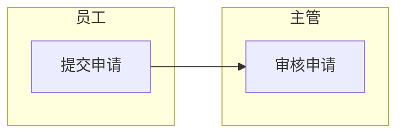

# 哮天犬

哮天犬是一个通用 Markdown 知识库查询 skill。它把 Markdown 文档解析成结构化记录，按领域、主题、条目定位知识内容，并结合意图路由、BM25、embedding、FAISS 和记忆文件完成查询。

## 适用场景

- 查询制度、流程、产品、规范、FAQ、手册等 Markdown 知识库。
- 按“领域 -> 主题 -> 条目 -> 知识内容”组织和检索资料。
- 支持主题列表、流程步骤、条目清单、规则依据等不同问法。
- 支持自定义意图路由，让不同领域按自己的关键词触发查询方式。
- 支持记住别名、提问偏好和回答偏好，但不把记忆当作知识事实。

## 目录结构

```text
xiao-tian-quan/
  SKILL.md
  agents/
    openai.yaml
  data/
    memory/
      retrieval_skills.json
  references/
    document-format.md
    intent_routes.template.json
  scripts/
    extract_knowledge_md.py
    query_knowledge_base.py
    route_knowledge_query.py
    build_all_indexes.py
    check_index_freshness.py
    ...
```

## 快速开始

准备一个知识库目录，例如：

```text
my-kb/
  docs/
    policy.md
  intent_routes.json
```

从 Markdown 提取结构化记录：

```powershell
python scripts/extract_knowledge_md.py my-kb/docs > my-kb/knowledge_records.json
```

查询知识库：

```powershell
python scripts/query_knowledge_base.py my-kb/knowledge_records.json "费用报销制度有哪些主题" --docs-dir my-kb/docs --intent-routes my-kb/intent_routes.json --index-dir my-kb/indexes --retrieval auto
```

## Markdown 文档格式

推荐用通用字段：

```markdown
# 示例制度
【领域名称】：费用报销制度
【主题名称】：报销范围、审批流程

# 报销范围

### [交通费] ###
【所属领域】：费用报销制度
【所属主题】：报销范围
【所属条目】：交通费
【责任主体】：员工
【知识内容】：市内交通费需要提供合规票据，并注明出行事由。
```

流程可以使用 Mermaid：

````markdown
# 审批流程

## 审批流程流程 ##
【所属领域】：费用报销制度
【所属主题】：审批流程
【流程图】：

````

完整格式见 `references/document-format.md`。

## 意图路由

意图路由决定“用户问题命中后怎么查”。模板在 `references/intent_routes.template.json`，建议复制为自己知识库里的 `intent_routes.json` 后修改。

```json
{
  "routes": {
    "topic_list": {
      "action": "branch_list",
      "keywords": ["有哪些主题", "主题列表", "有哪些模块"]
    },
    "workflow": {
      "action": "answer",
      "keywords": ["处理流程", "操作步骤", "怎么处理"]
    },
    "knowledge_rule": {
      "action": "search",
      "keywords": ["规则", "要求", "限制", "适用范围"]
    },
    "item_list": {
      "action": "item_list",
      "keywords": ["有哪些条目", "条目列表", "内容清单"]
    }
  }
}
```

`action` 含义：

- `branch_list`：返回领域下的主题、模块或章节列表。
- `answer`：回答流程类问题，优先读取 Mermaid 流程。
- `item_list`：返回某个领域或主题下的条目清单。
- `search`：检索知识内容、规则、条件、要求或依据。

## 索引与检索

查询时推荐传入 `--index-dir indexes`。脚本会检查索引是否存在或过期，必要时自动重建。

手动检查索引：

```powershell
python scripts/check_index_freshness.py knowledge_records.json indexes
```

手动重建全部索引：

```powershell
python scripts/build_all_indexes.py knowledge_records.json indexes
```

检索策略：

- `--retrieval auto`：自动选择，推荐默认使用。
- `--retrieval semantic`：语义检索，适合原因、能否、异常处理等问题。
- `--retrieval lexical`：关键词检索，适合原文、编号、字段、名称等问题。
- `--retrieval hybrid`：混合检索，适合同时包含关键词和语义判断的问题。

## 记忆文件

默认记忆文件固定在：

```text
data/memory/retrieval_skills.json
```

支持命令：

```text
记住别名：简称=完整名称
记住偏好：关键词=偏好说明
记住回答偏好：偏好说明
查看记忆
删除记忆：别名=简称
删除记忆：偏好=关键词
删除记忆：回答偏好=任意值
清空记忆
```

记忆只用于理解提问、扩展别名和控制回答形式，不得写入知识事实。知识事实必须更新 Markdown 原文。

如需临时改记忆目录：

```powershell
python scripts/query_knowledge_base.py knowledge_records.json "查看记忆" --memory-dir C:\path\to\memory
```

## 常用命令

提取记录：

```powershell
python scripts/extract_knowledge_md.py docs > knowledge_records.json
```

普通查询：

```powershell
python scripts/query_knowledge_base.py knowledge_records.json "你的问题" --docs-dir docs --intent-routes intent_routes.json --index-dir indexes --retrieval auto
```

关闭自动建索引：

```powershell
python scripts/query_knowledge_base.py knowledge_records.json "你的问题" --index-dir indexes --no-auto-index
```

完整输出长知识内容：

```powershell
python scripts/query_knowledge_base.py knowledge_records.json "你的问题" --max-rule-chars 0
```

## 输出原则

- 以 Markdown 知识库原文为准。
- 不新增原文没有的条件、角色、流程或结论。
- 查询不到准确依据时返回 `知识库中未找到准确依据`。
- 多轮追问可以结合当前线程上下文补全领域、主题或条目，但上下文不能作为新的知识事实来源。
